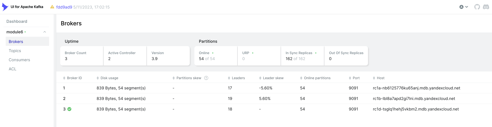

## Создание Kafka кластера (Yandex Cloud)


Создан кластер с тремя Kafka брокерами.

### Ресурсы

Выбраны по умолчанию, чтобы не выйти за рамки гранта.

Рекомендации для брокера:

- RAM: Не менее 32 GB, рекомендация 64 GB
- CPU: Dual 12-core sockets
- Диски: SSD: 12 дисков по 1 TB, RAID 10

### Конфигурация и топики


Создан топик `analytics-events` с `3 партициями` и `фактором репликации 3`.

Минимальное число синхронных реплик (`min.insync.replicas`) установлено как `2`.

Политика очистки лога (`log.cleanup.policy`) выбрана `delete`.

- Максимальный размер файла сегмента лога партиции (`log.segment.bytes`) составляет `100 MB`.
- Неактивные файлы сегментов будут удалены либо по времени (`log.retention.ms`) - старше `7 дней`, либо когда размер лога партиции (`log.retention.bytes`) превысит `1 GB`.
- Задержка удаления (`log.segment.delete.delay.ms`) установлена `1 минута`.

Максимальный размер группы сообщений (`max.message.bytes`) выбран `1 MB`.

Информация о созданном топике (вывод команды `kafka-topics.sh --describe`):

```bash
kafka-topics \
    --bootstrap-server rc1a-nb6125776ku65anj.mdb.yandexcloud.net:9091 \
    --describe \
    --command-config client.properties
```

```
Topic: analytics-events
TopicId: Ar11Zc42QIOBts2ubCkevA

PartitionCount: 3
ReplicationFactor: 3

Configs: min.insync.replicas=2,cleanup.policy=delete,follower.replication.throttled.replicas=*,segment.bytes=104857600,retention.ms=604800000,file.delete.delay.ms=60000,max.message.bytes=1048576,retention.bytes=1073741824

Topic: analytics-events Partition: 0    Leader: 2       Replicas: 2,1,3 Isr: 2,1,3      Elr: N/A        LastKnownElr: N/A
Topic: analytics-events Partition: 1    Leader: 3       Replicas: 3,2,1 Isr: 3,2,1      Elr: N/A        LastKnownElr: N/A
Topic: analytics-events Partition: 2    Leader: 1       Replicas: 1,3,2 Isr: 1,3,2      Elr: N/A        LastKnownElr: N/A
```

### Пользователи

Заведены три пользователя

- `admin`
- `analytics-events-producer` с разрешением на запись в топик `analytics-events`
- `analytics-events-consumer` с разрешением на чтение из топика `analytics-events`


## Локальные контейнеры

### Schema Registry

Локально развернут `Schema Registry`.
Добавлена схема.

```bash
curl http://localhost:8081/subjects

curl http://localhost:8081/subjects/analytics-events-value/versions
```


### Kafka UI

Локально развернут `Kafka UI`.




### Hadoop

Локально развернут `Hadoop`.
`Namenode` и три `DataNode`.

- Настроено:

  - HTTPS для веб-интерфейсов (NameNode: 9871, DataNodes: 9864-9866)
  - HTTPS для WebHDFS REST API (используется консюмером для записи/чтения файлов)
  - Консюмер работает под пользователем `kafka-consumer`

- Не настроено:
  - Шифрование данных между DataNodes
  - Аутентификация

Включение шифрования данных блокирует репликацию между DataNodes без аутентификации. А в Hadoop нет простого аналога SASL/PLAIN из Kafka, нужно использовать более сложную конфигурацию (Kerberos). Поэтому для примера ограничился HTTPS и "разделением" пользователей.

### Продюсер и консюмер

Добавлены тестовые скрипты продюсера и консюмера для проверки записи и чтения сообщений.

## Запуск и проверка решения

### 1. Запуск и проверка инфраструктуры

```bash
docker compose up -d

docker compose ps
```


### 2. Создание директории /analytics/events для HDFS и выдача прав

```bash
docker exec hadoop-namenode hdfs dfs -mkdir -p /analytics/events

docker exec hadoop-namenode hdfs dfs -chmod -R 777 /analytics/events
```

### 3. Проверка записи сообщений в топик

```bash
python3 producer.py
```


### 4. Проверка чтения сообщений из топика и записи файла в HDFS

```bash
python3 consumer.py
```


### 5. Проверка файлов, записанных в HDFS

- Получим список файлов

```bash
docker exec hadoop-namenode hdfs dfs -ls /analytics/events/
```


- Прочитаем один из файлов

```bash
docker exec hadoop-namenode hdfs dfs -cat /analytics/events/id_144
```


